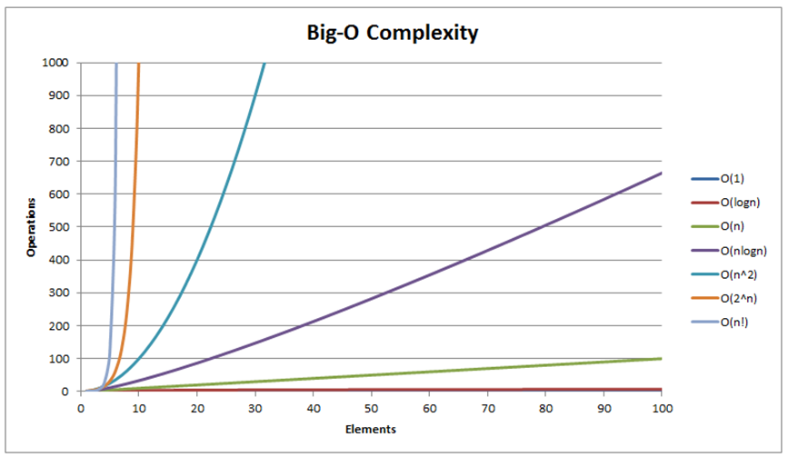

# Sorting Algorithms

- Start with Bubble Sort: Understand the concept of swapping elements and iterating through the list repeatedly until it's sorted
- Move to Selection Sort: Learn how to find the minimum element and place it at the correct position in each iteration
- Proceed to Insertion Sort: Understand how to build a sorted list by inserting elements into the right position

### Bubble Sort

Bubble Sort is a way to arrange elements in an array in a specific order, such as from smallest to largest. It is called bubble sort because we 'bubble' any element that needs to be ordered up or down the array until it is in its correct position

Bubble sort is an _inefficient_ sorting algorithm. Specifically, it runs in O(n^2) time, which is quadratic. That means that as the size of the input array increases, the running time of the algorithm grows quadratically. This is because bubble sort requires nested loops, which result in a time complexity proportional to the square of the input size...

But what does that actually mean? As the number of elements in the array increases, the time need to sort it doesn't increase evenly - instead, it grows _much_ faster! If the number of elements doubles the time needed could increase **four times**, not just double. As seen in the graph below (third line from the left), we can see that by the time our array has 30 elements we have nearly 1000 operations needed



<details>
  <summary>Bubble Sort Solution</summary>
  
```TypeScript
const bubbleSort = (arr: number[]): number[] => {
  for (let i = 0; i < arr.length; i++) {
    for (let j = 0; j < arr.length - i; j++) {
      let current = arr[j];
      let next = arr[j + 1];
      if (current > next) {
        arr[j] = next;
        arr[j + 1] = current;
      }
    }
  }
  return arr;
};
```

</details>
